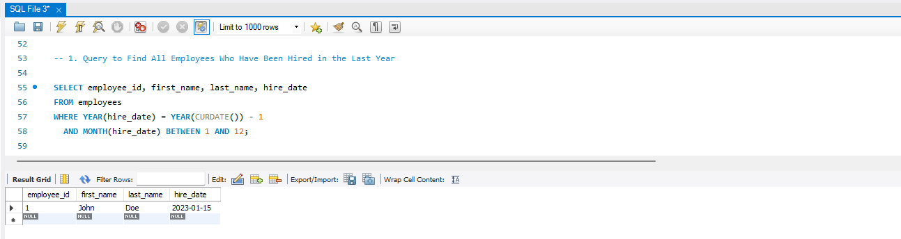
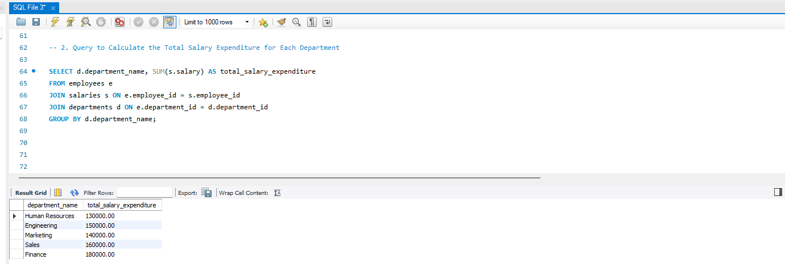
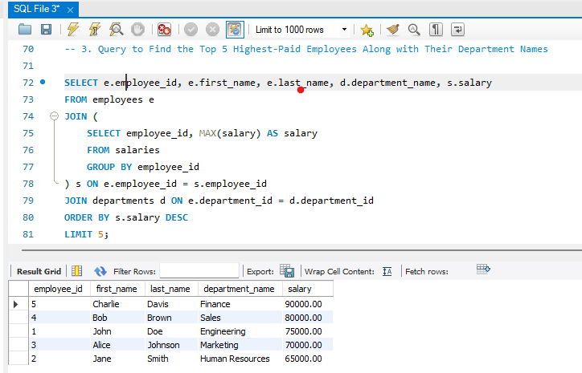

# Employee Management System

**Objective**: To test the ability to design relational databases, write complex SQL queries, and handle data relationships.

## 1. Database Schema Design

The database schema includes three tables: `employees`, `departments`, and `salaries`.

- **employees** table:
  - `employee_id` (INT, Primary Key)
  - `first_name` (VARCHAR(50))
  - `last_name` (VARCHAR(50))
  - `department_id` (INT, Foreign Key referencing `departments(department_id)`)
  - `hire_date` (DATE)

- **departments** table:
  - `department_id` (INT, Primary Key)
  - `department_name` (VARCHAR(50))

- **salaries** table:
  - `employee_id` (INT, Foreign Key referencing `employees(employee_id)`)
  - `salary` (DECIMAL(10, 2))
  - `from_date` (DATE)
  - `to_date` (DATE)
 
## 2. SQL Queries

### a. Query to Find All Employees Who Have Been Hired in the Last Year

### b. Query to Calculate the Total Salary Expenditure for Each Department

### c. Query to Find the Top 5 Highest-Paid Employees Along with Their Department Names

## Summary

- SQL queries were written to:
  - Find employees hired in the last year.
  - Calculate total salary expenditure for each department.
  - Find the top 5 highest-paid employees along with their department names.
- The results of these queries were captured and saved as images in the `docs/` folder.
